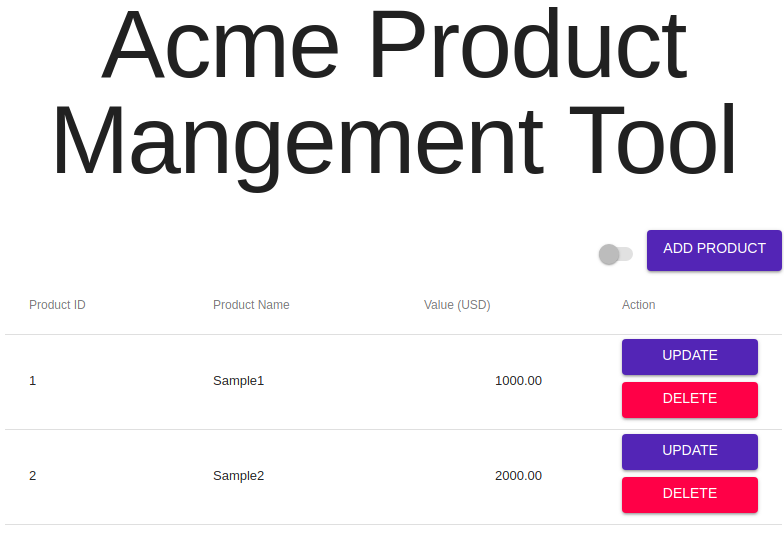

# Product Management SPA

An example product management single-page-application



## Tech Stack

- React/Redux/Redux-Saga/Material UI on the frontend
- Express db backend
- Dynamo DB (AWS) local database

## Functionality not included: 

- Backend form validation.
- Frontend form validation. 
- Nice loading flags. (ie. loading cursor)
- More useful error handling. (Just shows a generic 'something went wrong' error message).
- Unit tests. 

## Getting it running

I have included two scripts in the base directory, these should work provided: 

- You have docker installed
- You have node installed
- You have npm installed

In one terminal window run 

```
./run_backend.sh
```

When it is complete, open a new terminal window and run 

```
./run_frontend.sh
```

Open your browser to `localhost:3000`. 

### Explaination of scripts

The backend script first starts dynamodb-local running on your local docker environment. 

It then creates the `Products` table on it, and adds some data. 

It then starts an express server on port `3001` . 

The frontend script starts running the create-react-app webpack-dev-server, proxying `/api/*` calls to `localhost:3001`. 


